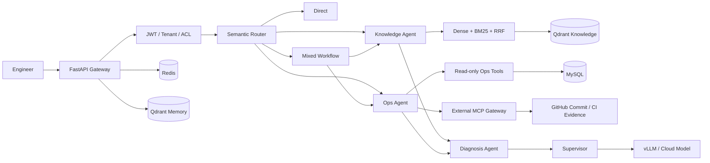

# DevPilot — 企业级研发运维 Multi-Agent Copilot

DevPilot 是一个面向研发运维场景的证据驱动型 Copilot，将文档中的部署规范、应急预案和排障手册，与业务系统中的服务状态、发布记录、故障事件和工单统一到一个对话式工作入口，帮助工程师连续完成：

> 查知识 → 查现状 → 联合诊断 → 生成处理方案

它不是简单的“企业文档聊天机器人”。系统明确区分静态知识与实时事实：RAG 负责回答“规范上应该怎么做”，参数化只读工具负责查询“生产环境实际发生了什么”，多 Agent 再基于两类证据完成联合诊断。

## 核心能力

- **语义路由**：将请求划分为 Direct、Knowledge、Ops、Mixed 四条执行路径。
- **多 Agent 协作**：Supervisor、Knowledge、Ops、Diagnosis 分工完成检索、查询、诊断与答案合成。
- **混合 RAG**：Dense Retrieval + BM25 + RRF，兼顾自然语言语义和服务名、错误码等精确术语。
- **可信事实工具**：服务、发布、故障、工单均通过参数化只读 Tool 查询，禁止模型自由生成 SQL。
- **外部 MCP 证据**：可选接入只读 GitHub MCP，将发布记录中的 commit_sha 与真实代码变更关联。
- **上下文工程**：Structured SessionMemory + Sliding Window + LLM Rolling Summary + ContextProjector。
- **长期记忆**：基于 Qdrant 实现跨会话记忆，并按 tenant/user 隔离、处理冲突和时效性。
- **企业权限边界**：四级 RBAC、Service/Repository Scope、JWT 身份认证、租户隔离、文档 ACL、用户级缓存与会话权限校验。
- **本地优先推理**：支持 vLLM 本地模型与云端强模型角色路由，企业内部数据默认不出本地。
- **可观测与评测**：组件级健康检查、工具/模型审计、检索评测、Agent A/B 与安全对抗测试。
- **完整管理控制台**：运行总览、Agent 对话、发布记录、故障工单、知识库和历史会话管理。

## 系统架构



## 技术栈

| 领域 | 技术 |
| --- | --- |
| API 与工作流 | FastAPI、Pydantic、LangGraph |
| 数据与缓存 | MySQL 8、Redis、SQLAlchemy |
| RAG 与记忆 | Qdrant、multilingual-e5、BM25、RRF、可选 Reranker |
| 模型服务 | vLLM、Qwen、OpenAI-compatible API、可选云端强模型 |
| 外部集成 | MCP Streamable HTTP、GitHub MCP、Tool Allowlist |
| 安全 | JWT、PBKDF2、Tenant/Resource ACL、只读参数化 Tool |
| 前端 | HTML、CSS、JavaScript（FastAPI 静态托管） |
| 测试评测 | Pytest、Retrieval Eval、Agent Eval、Single/Multi Agent A/B |

## 请求如何执行

| 路径 | 适用问题 | 执行方式 |
| --- | --- | --- |
| Direct | 普通交流、能力说明 | 直接回答 |
| Knowledge | 部署规范、接口约定、应急预案 | Hybrid RAG + Citation |
| Ops | 当前服务、发布、故障、工单 | 参数化只读 Tool |
| Mixed | “结合失败发布和 SOP 给出排查方案” | Knowledge + Ops + Diagnosis + Supervisor |

## 上下文与记忆

```text
当前会话 Turn
    ↓
Structured SessionMemory
    ├── Sliding Window：保留近期原始消息
    ├── Rolling Summary：增量压缩窗口外历史
    └── ContextProjector：投影实体、目标、约束和工具状态
    ↓
组装为受预算控制的 LLM Context

跨会话 Long-term Memory
    └── Qdrant + tenant_id/user_id 过滤 → 新会话按需召回
```

## 项目结构

```text
app/                 FastAPI、Agent、RAG、Tools、认证与 Web UI
data/enterprise_docs 合成企业知识库文档
data/eval/            检索、Agent、对话和安全评测集
docs/                 架构、部署、上下文与面试学习文档
scripts/              初始化、导入、评测和运维脚本
sql/                  数据库 Schema、Seed 与迁移
tests/                自动化测试
wsl/                  WSL2 + vLLM 安装和启动脚本
```

## 快速开始（Windows 11 + WSL2 + Docker）

### 1. 准备配置

```bat
copy .env.example .env
```

至少修改以下配置，禁止在公开仓库提交 `.env`：

```env
MYSQL_PASSWORD=<strong-password>
MYSQL_ROOT_PASSWORD=<different-strong-password>
AUTH_SECRET_KEY=<at-least-32-random-characters>
AUTH_ADMIN_PASSWORD=<admin-password>
AUTH_ENGINEER_PASSWORD=<engineer-password>
```

### 2. 一键安装与启动

```bat
00_PRECHECK_WIN11.cmd
01_ONE_CLICK_SETUP_WIN11.cmd
02_ONE_CLICK_START_WIN11.cmd
```

本地开发首次运行时，启动脚本会自动启动 Docker Desktop，并为缺失的数据库、JWT 和演示账号生成随机凭据。登录信息只写入 Git 已忽略的 `.devpilot-credentials.txt`；如果已有 `devpilot-mysql` 数据卷，会复用容器原有数据库密码，避免修改 `.env` 后无法连接旧数据。生产环境仍必须使用 Secret Manager 显式配置，不能依赖本地自动生成。

默认入口：

- Web 控制台：<http://127.0.0.1:8001/>
- OpenAPI 文档：<http://127.0.0.1:8001/docs>
- Qdrant Dashboard：<http://127.0.0.1:6333/dashboard>

无 GPU 或 vLLM 时可保持 `LLM_MODE=mock` 验证基础设施、RAG 和 Tool 链路。完整部署步骤见 [部署指南](docs/DEPLOYMENT.md)。

### 可选：连接 GitHub MCP

```env
GITHUB_MCP_ENABLED=true
GITHUB_MCP_URL=<your-streamable-http-mcp-endpoint>
GITHUB_MCP_TOKEN=<read-only-token>
GITHUB_MCP_TOOL_ALLOWLIST=["get_commit"]
GITHUB_MCP_REPOSITORIES={"order-service":"your-org/order-service"}
```

当用户询问 Commit、PR、代码变更或 CI 失败时，Ops Agent 会先读取内部发布事实，再通过 MCP 获取对应代码证据。未配置或调用失败时，系统保留内部 Tool 与 RAG 结果并明确降级，不猜测外部事实。详见 [外部 MCP 集成设计](docs/EXTERNAL_MCP_INTEGRATION.md)。

## 数据与评测

```bat
05_INGEST_SAMPLE_DOCS_WIN11.cmd
06_SMOKE_TEST_WIN11.cmd
07_EVAL_RETRIEVAL_WIN11.cmd
08_EVAL_AGENT_WIN11.cmd
13_EVAL_CONVERSATION_WIN11.cmd
14_EVAL_AGENT_AB_WIN11.cmd
16_EVAL_SECURITY_WIN11.cmd
17_PREPARE_REFERENCE_CASE_WIN11.cmd
```

当前自动化测试基线：**75 tests passed**；另有真实 API 的 RBAC 在线冒烟脚本。

真实参考案例可额外运行 `python scripts/eval_reference_case.py`，验证固定来源知识能被 RAG 召回且 `reference` 发布记录可被 Ops 数据层读取。

> 评测指标只应使用脚本真实输出，不在 README 中预编准确率、召回率或性能收益。

## 安全说明

- `.env`、API Key、模型凭据和生产数据不得提交到 Git。
- 生产环境必须更换数据库密码、认证密钥和初始用户密码。
- `ALLOW_CLOUD_INTERNAL_DATA` 默认应保持 `false`。
- 运行事实工具保持只读，并在工具层执行租户和资源权限校验。
- `end_user → developer → tenant_admin` 按业务能力继承；`system_admin` 独立，不默认继承任何租户内容权限。完整设计见 [docs/RBAC_DESIGN.md](docs/RBAC_DESIGN.md)。
- 已经公开过的 Key 必须在供应商控制台撤销，不能仅从 Git 历史中删除。

详见 [SECURITY.md](SECURITY.md)。

## 延伸文档

- [多 Agent V2 架构](docs/MULTI_AGENT_V2.md)
- [上下文、RAG 与会话设计](docs/CONTEXT_RAG_SESSION_DESIGN.md)
- [项目学习与面试指南](docs/INTERVIEW_STUDY_GUIDE.md)
- [面试速查表](docs/INTERVIEW_CHEATSHEET.md)
- [部署指南](docs/DEPLOYMENT.md)
- [外部 MCP 集成设计](docs/EXTERNAL_MCP_INTEGRATION.md)
- [真实参考案例：Online Boutique v0.10.7](docs/REAL_REFERENCE_CASE.md)
- [简历项目描述与面试表达](docs/RESUME_PROJECT_DESCRIPTION.md)
- [项目演示与测试手册](docs/DEMO_GUIDE.md)

## Roadmap

- Token-level SSE 流式输出
- OpenTelemetry / Langfuse 全链路追踪
- 企业 OIDC/SSO、Refresh Token 与 Token 吊销
- Qdrant 原生 Sparse Retrieval
- 更大规模的无答案、对抗和单/多 Agent A/B 评测

## 项目定位

DevPilot 的核心不是“让模型知道更多”，而是让模型在明确的权限、证据和工作流边界内工作：知识有引用，事实来自工具，诊断展示依据，数据按租户和用户隔离。
